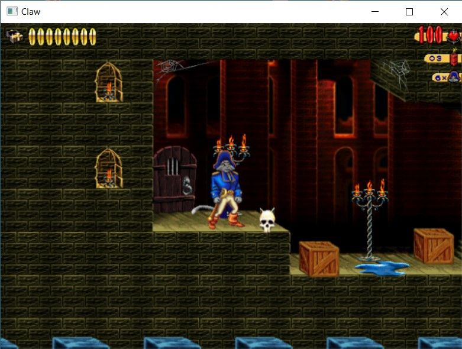

# Captain Claw
Realization of the beloved game "Claw", released by Monolith Productions in 1997

_by Ariel Halili_

### Sub-projects:
- *Framework* - General libary for all sub-projects.
- *RezParser* - Classes and methods to prase the REZ file and its content. Based on OpenClaw/libwap.
- *ExtractRez* - Saves the parsed REZ file to local directory.
- *GameEngine* - Library of GUI and Audio management.
- **MyClaw** - The main game (for now it just for test the other libraries).

### Credits:
- https://captainclaw.net/ - the Claw Recluse
- https://github.com/pjasicek/OpenClaw/tree/master/libwap - REZ file parser and its content (.PID, .ANI, etc.)
- https://github.com/freudi74/mfimage - PCX file parser
- https://blog.fourthwoods.com/2012/02/24/playing-midi-files-in-windows-part-5/ - midi parser
- https://github.com/BuildSucceeded/2D-Platformer - the initial idea for the realization of the project

### Screenshot:

